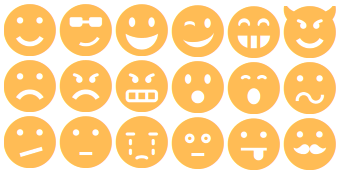

Emoticon Extension for [Mecha](https://github.com/mecha-cms/mecha)
==================================================================

This extension replaces every emoticon and smiley patterns (which you can also set it yourself) into a graphical emoticon icons. Icon font credit to [Icomoon](http://icomoon.io "IcoMoon – Custom Built and Crisp Icon Fonts").